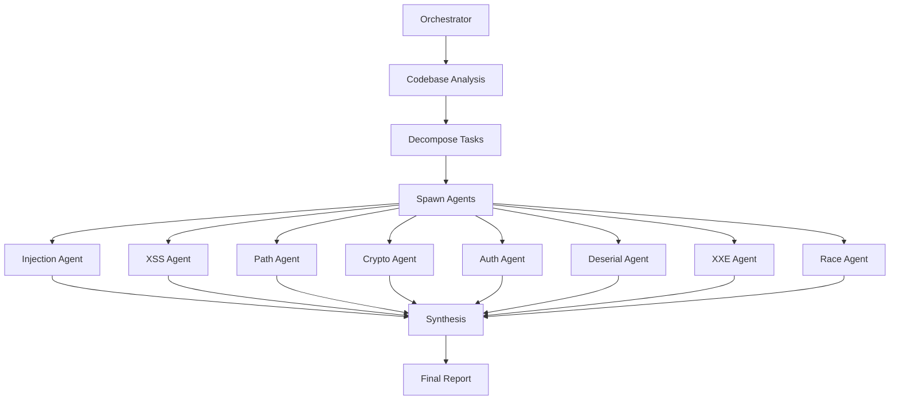

# AI Orchestrator Mode

The AI Orchestrator Mode enhances codesucks-ai's comprehensive scanning with a sophisticated deep analysis layer using Claude Code SDK sub-agents. This mode adds an advanced AI analysis layer on top of traditional SAST and secret detection.

## Overview

The orchestrator mode provides **enhanced comprehensive analysis** through three integrated layers:

1. **Static Analysis** (Semgrep via MCP or CLI) - Traditional SAST scanning with configurable rulesets
2. **Secret Detection** (TruffleHog) - API keys, credentials, and sensitive data detection  
3. **Deep AI Analysis** (Orchestrator) - 5 specialized Claude Code subagents executing advanced vulnerability analysis

**Status**: FULLY FUNCTIONAL - All orchestrator issues have been resolved

The orchestrator executes a **7-phase deep analysis workflow**:

1. **Initialize Code Analysis** - Setup session and workspace
2. **Analyze Codebase Structure** - Detect languages, frameworks, entry points
3. **Map Entry Points and Data Flow** - Identify input sources and dangerous sinks
4. **Decompose into Parallel Analyses** - Create specialized analysis tasks
5. **Execute Parallel Code Analysis** - Run 5 specialized security agents simultaneously
6. **Synthesize and Validate Findings** - Deduplicate and validate results
7. **Generate Code Security Report** - Create comprehensive developer-friendly reports

## Specialized Security Agents

The orchestrator coordinates 5 specialized Claude Code sub-agents:

| Agent | Focus Area | Capabilities | Status |
|-------|------------|-------------|---------|
| **code-injection-analyser** | SQL, NoSQL, LDAP, OS Command injection | Data flow analysis, parameterization validation | Working |
| **code-xss-analyser** | Reflected, Stored, DOM-based XSS | Output encoding analysis, template security | Working |
| **code-path-analyser** | Path traversal, file inclusion | Directory validation, symlink detection | Working |
| **code-crypto-analyser** | Cryptographic implementation flaws | Algorithm analysis, key management review | Working |
| **code-auth-analyser** | Authentication, authorization flaws | Session management, access control validation | Working |

Additional agents available but not used in current implementation:
- **code-deserial-analyser** - Unsafe deserialization analysis
- **code-xxe-analyser** - XML external entity vulnerabilities  
- **code-race-analyser** - Race conditions and TOCTOU vulnerabilities

## 🛠️ Quick Start

### Prerequisites

- **Claude Code CLI** - Required for subagent spawning (must be in PATH)
- **uv** - Python virtual environment manager (for MCP setup)
- **Go 1.21+** - For building the application  
- **Anthropic API Key** - Get from [Anthropic Console](https://console.anthropic.com)
- **GitHub Token** - Create a [Personal Access Token](https://github.com/settings/tokens)

### Environment Setup

**Simple Setup (Recommended):**
```bash
# Install uv
curl -LsSf https://astral.sh/uv/install.sh | sh

# Create .env file with your credentials
cat > .env << EOF
ANTHROPIC_API_KEY=sk-ant-api03-xxxxxxxxxxxxx
GITHUB_TOKEN=github_pat_xxxxxxxxxxxxx
EOF

# One-command setup
./run-orchestrator.sh --setup-only
```

**Manual Setup (if needed):**
```bash
export ANTHROPIC_API_KEY="sk-ant-api03-xxxxxxxxxxxxx"
export GITHUB_TOKEN="github_pat_xxxxxxxxxxxxx"

# Setup MCP environment
uv venv mcp-env
source mcp-env/bin/activate
uv pip install semgrep-mcp semgrep
```

### Run Enhanced Comprehensive Analysis

#### Option 1: Enhanced Comprehensive Scan
```bash
# Comprehensive scan with deep AI analysis (SAST + Secrets + AI)
./build/codesucks-ai -repo https://github.com/owner/repo -orchestrator-mode

# With custom configuration
./build/codesucks-ai -repo https://github.com/owner/repo -config-file configs/comprehensive.yaml
```

#### Option 2: Quick Start Script (Recommended)
```bash
# Enhanced analysis with convenient script
./scripts/run-orchestrator.sh -r https://github.com/owner/repo

# Run with Docker sandboxing
./scripts/run-orchestrator.sh -r https://github.com/owner/repo --docker

# Custom configuration
./scripts/run-orchestrator.sh -r https://github.com/owner/repo -c configs/orchestrator.yaml
```

#### Option 3: Docker Execution
```bash
# Docker execution
docker-compose -f docker/docker-compose.orchestrator.yml run --rm codesucks-ai-orchestrator \
  -orchestrator-mode \
  -repo https://github.com/owner/repo
```

## 📋 Configuration

### YAML Configuration

The orchestrator uses YAML configuration files for comprehensive setup:

```yaml
# configs/orchestrator.yaml
orchestrator:
  enabled: true
  session_dir: "./sessions"
  agents_dir: "./agents" 
  timeout: 3600
  max_agents: 8

agent_settings:
  injection_analyser:
    enabled: true
    model: "claude-3-5-sonnet-20241022"
    max_tokens: 4096
    timeout: 600
    file_patterns: ["*.py", "*.js", "*.java", "*.go"]
    confidence_threshold: 0.85
    
  # ... other agents
```

### CLI Options

| Option | Description | Default |
|--------|-------------|---------|
| `-orchestrator-mode` | Enable orchestrator mode | `false` |
| `-session-dir` | Session data directory | `./sessions` |
| `-agents-dir` | Agent configurations directory | `./agents` |
| `-config-file` | YAML configuration file | `configs/orchestrator.yaml` |

## 🏗️ Architecture

### Session Management

Each orchestrator run creates a unique session:

```
sessions/
├── {session-id}/
│   ├── orchestrator_state.json    # Main orchestrator state
│   ├── sub_agents/                # Agent session data
│   │   ├── agent_injection_001_state.json
│   │   ├── agent_xss_002_state.json
│   │   └── ...
│   ├── vulnerable_code/           # Code snippets for analysis
│   └── security_report.md         # Final report
```

### Agent Coordination



## 📊 Output & Reports

### Enhanced Security Reports

The orchestrator generates comprehensive reports with:

- **Executive Summary** with vulnerability density metrics
- **Critical Vulnerabilities** with exploit examples and secure fixes
- **Systemic Security Issues** with pattern recognition
- **Security Improvements Roadmap** with prioritized actions
- **Code Examples** for immediate implementation

### Report Structure

```markdown
# Code Security Analysis Report

## Summary
- Total vulnerabilities found: 23
- Critical: 3 | High: 7 | Medium: 10 | Low: 3
- Most vulnerable components: authentication, file handlers
- Systemic issues requiring attention: 4

## Critical Vulnerabilities

### 1. SQL Injection in User Controller
**File**: `src/controllers/user.py:42-45`
**CWE-89**: Improper Neutralization of Special Elements

#### Vulnerable Code
```python
query = f"SELECT * FROM users WHERE id = {user_id}"
```

#### How to Exploit
```bash
curl 'http://app/api/user?id=1 OR 1=1--'
```

#### Secure Alternative
```python
query = "SELECT * FROM users WHERE id = ?"
cursor.execute(query, (user_id,))
```
```

## 🐳 Docker Integration

### Docker Compose Setup

The orchestrator includes Docker Compose configuration for isolated execution:

```yaml
# docker-compose.orchestrator.yml
version: '3.8'
services:
  codesucks-ai-orchestrator:
    build: .
    environment:
      - ANTHROPIC_API_KEY=${ANTHROPIC_API_KEY}
      - GITHUB_TOKEN=${GITHUB_TOKEN}
    volumes:
      - ./sessions:/app/sessions
      - ./results:/app/results
      - ./agents:/app/agents:ro
    security_opt:
      - no-new-privileges:true
    deploy:
      resources:
        limits:
          cpus: '4.0'
          memory: 8G
```

### Security Features

- **Process isolation** with separate containers
- **Resource limits** (CPU, memory, disk)
- **Read-only filesystem** for agent configurations
- **Network isolation** between agent containers
- **No new privileges** security setting

## ⚡ Performance & Scalability

### Parallel Execution

- **8 agents** run simultaneously by default
- **Configurable concurrency** based on system resources
- **Resource monitoring** with automatic throttling
- **Progress tracking** with 30-second updates

### Resource Requirements

| Component | CPU | Memory | Disk |
|-----------|-----|--------|------|
| Orchestrator | 1 core | 2GB | 1GB |
| Each Agent | 0.5 core | 1GB | 500MB |
| **Total Recommended** | **4+ cores** | **8+ GB** | **5+ GB** |

## 🔧 Advanced Configuration

### Custom Agents

Create custom agent configurations:

```markdown
---
name: custom-security-agent
description: Custom security analysis for specific frameworks
tools: Read, Edit, Bash, Glob, Grep, LS, Task, Write
---

You are a specialized security agent focused on...

## Analysis Methodology
1. Identify framework-specific patterns
2. Trace data flow vulnerabilities
3. Generate secure code alternatives
```

### Agent Filtering

Configure which agents run and their scope:

```yaml
agent_settings:
  injection_analyser:
    enabled: true
    file_patterns: ["*.py", "*.js"]
    exclude_patterns: ["*/test/*", "*_test.py"]
    confidence_threshold: 0.85
    
  xss_analyser:
    enabled: false  # Disable this agent
```

### Timeouts & Limits

```yaml
orchestrator:
  timeout: 3600        # 1 hour total
  max_agents: 8        # Parallel agent limit
  
agent_settings:
  injection_analyser:
    timeout: 600       # 10 minutes per agent
    max_tokens: 4096   # Claude token limit
```

## 🚨 Troubleshooting

### Common Issues

#### "Agent failed to start"
- Check `ANTHROPIC_API_KEY` is valid
- Ensure agent configurations exist in `agents/` directory
- Verify sufficient system resources

#### "Session directory not writable"
- Check filesystem permissions
- Ensure Docker volume mounts are correct
- Verify sufficient disk space

#### "Analysis timeout"
- Increase timeout values in configuration
- Reduce the number of parallel agents
- Check for hanging processes

### Debug Mode

Enable detailed logging:

```bash
./run-orchestrator.sh -r https://github.com/owner/repo --debug

# Or via CLI
./codesucks-ai -orchestrator-mode -debug -repo https://github.com/owner/repo
```

### Log Locations

```
sessions/{session-id}/
├── orchestrator.log        # Main orchestrator logs
├── sub_agents/
│   ├── agent_001.log      # Individual agent logs
│   └── agent_002.log
└── errors.log             # Error aggregation
```

## 🔗 Integration

### CI/CD Pipeline

```yaml
# GitHub Actions example
name: Security Analysis
on: [push, pull_request]

jobs:
  security-scan:
    runs-on: ubuntu-latest
    steps:
      - uses: actions/checkout@v4
      - name: Run Orchestrator Analysis
        env:
          ANTHROPIC_API_KEY: ${{ secrets.ANTHROPIC_API_KEY }}
          GITHUB_TOKEN: ${{ secrets.GITHUB_TOKEN }}
        run: |
          ./run-orchestrator.sh -r ${{ github.repository }} --docker
          
      - name: Upload Results
        uses: actions/upload-artifact@v4
        with:
          name: security-results
          path: results/
```

### API Integration

The orchestrator can be integrated with external systems via its JSON state files and REST endpoints (if web mode is enabled).

## 📈 Metrics & Monitoring

### Built-in Metrics

- **Vulnerability density** (vulnerabilities per 1000 lines of code)
- **Agent performance** (processing time, success rate)
- **Coverage analysis** (files scanned vs total files)
- **Pattern recognition** (systemic issues identified)

### Custom Monitoring

Monitor orchestrator health via:
- Session state JSON files
- Agent progress logs
- Resource utilization metrics
- Claude API usage tracking

## 🤝 Contributing

To extend the orchestrator:

1. **Create new agents** in `agents/` directory
2. **Add agent types** to `common/types.go`
3. **Update orchestrator logic** in `common/orchestrator/`
4. **Test with sample repositories**

See the main [Contributing Guide](../CONTRIBUTING.md) for detailed instructions.

---

## 🎯 Next Steps

1. **Try the quick start example** above
2. **Customize agent configurations** for your tech stack
3. **Integrate into CI/CD pipeline** for continuous security
4. **Explore advanced reporting features**
5. **Contribute new specialized agents**

For questions and support, see our [Troubleshooting Guide](TROUBLESHOOTING.md) or open an issue on GitHub.